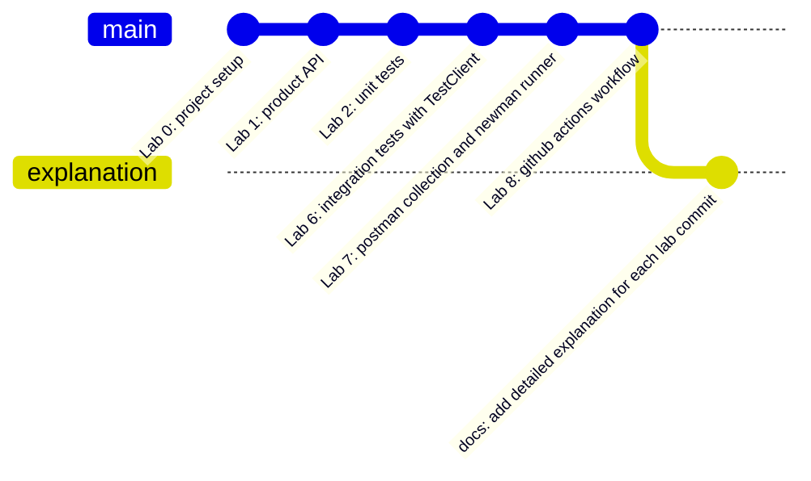

# 📖 สรุปและคำอธิบายการทำแบบฝึกหัดแต่ละ Commit (FastAPI Testing Lab)

เอกสารนี้จัดทำขึ้นเพื่ออธิบายรายละเอียดการทำงาน สถาปัตยกรรม แนวคิดการทดสอบ และสิ่งที่ได้ทำไปในแต่ละ Commit/Lab อย่างละเอียด เพื่อใช้เป็นคู่มืออ้างอิงและทำความเข้าใจกระบวนการพัฒนาและทดสอบซอฟต์แวร์ด้วย **FastAPI, pytest, Postman, Newman และ GitHub Actions**

---

## 📌 ภาพรวมสถาปัตยกรรมและลำดับ Commit ทั้งหมด

---

## 🔍 คำอธิบายรายละเอียดในแต่ละ Commit

---

### 1️⃣ Commit: `Lab 0: project setup` (`440b9c8`)
> **เป้าหมาย:** เตรียมโครงสร้างโปรเจกต์ สิ่งแวดล้อมเสมือน (Virtual Environment) และเครื่องมือที่จำเป็นสำหรับการพัฒนาและทดสอบ

#### 📂 สิ่งที่ทำและไฟล์ที่เกี่ยวข้อง:
- **`requirements.txt`**: กำหนดแพ็กเกจที่ต้องใช้งาน ได้แก่ `fastapi`, `uvicorn`, `httpx`, `pytest`, `pytest-cov`
- **`pytest.ini`**: กำหนดค่าเริ่มต้นให้ pytest โดยระบุ `testpaths = tests`, `pythonpath = .` (เพื่อให้เทสต์สามารถ import โมดูลจาก `app` ได้โดยตรงจาก root โฟลเดอร์) และตั้งค่ากรอง Warning ที่ไม่เกี่ยวข้อง
- **`.gitignore`**: ป้องกันไม่ให้ Git ติดตามโฟลเดอร์ที่ไม่จำเป็น เช่น `.venv/`, `__pycache__/`, `.pytest_cache/`, `.coverage`, `reports/*.html`
- **โครงสร้างโฟลเดอร์ & `__init__.py`**: สร้างโฟลเดอร์ `app/` (แยกเป็น `services/`, `repositories/`, `routers/`) และ `tests/` (แยกเป็น `unit/`, `integration/`) พร้อมใส่ไฟล์ `__init__.py` เพื่อให้ Python มองแต่ละโฟลเดอร์เป็น Package

#### 💡 แนวคิดทางวิศวกรรมซอฟต์แวร์:
- **Separation of Dependencies:** การแยก environment ของโปรเจกต์ออกจากระบบหลัก ป้องกันปัญหา version conflict
- **Project Structure Standard:** การจัดวางโครงสร้างแบบ Modular Architecture ช่วยให้ขยายขนาดระบบ (Scalability) และเขียนเทสต์แยกเลเยอร์ได้ง่าย

---

### 2️⃣ Commit: `Lab 1: product API` (`c2514da`)
> **เป้าหมาย:** พัฒนา REST API สำหรับระบบสินค้า (Product API) โดยแบ่ง Layer อย่างชัดเจนตามหลัก Clean Architecture

#### 📂 สิ่งที่ทำและไฟล์ที่เกี่ยวข้อง:
1. **`app/errors.py` (Domain Exceptions):**
   - สร้างคลาส Exception กลาง `AppError`
   - สร้างคลาสลูกที่กำหนด `status_code` เฉพาะตัว เช่น `ValidationError` (400), `BadRequestError` (400), `UnauthorizedError` (401), `NotFoundError` (404)
2. **`app/repositories/product_repository.py` (Data Access Layer):**
   - สร้าง `InMemoryProductRepository` สำหรับเก็บและจัดการข้อมูลใน Memory แทนฐานข้อมูลจริง
   - ทุก Method คืนค่าแบบสำเนา `dict(product)` เพื่อป้องกันไม่ให้ภายนอกแก้ไขข้อมูลต้นฉบับโดยตรง (Immutability/Data Integrity)
3. **`app/services/product_service.py` (Business Logic Layer):**
   - **Pure Functions:**
     - `calculate_final_price(price, discount_percent)`: คำนวณราคาหลังหักส่วนลด ใช้ `Decimal` ปัดเศษแบบ `ROUND_HALF_UP` 2 ตำแหน่ง เพื่อความแม่นยำทางการเงิน
     - `validate_product(data, partial)`: ตรวจสอบความถูกต้องของข้อมูลตามกฎธุรกิจ (เช่น ชื่อห้ามว่าง, ราคา > 0, stock >= 0, ส่วนลด 0-100)
   - **`ProductService`:**
     - ใช้หลักการ **Dependency Injection (DI)** โดยรับ `repository` ผ่าน Constructor ทำให้สามารถส่ง Mock Repository เข้ามาทดสอบได้ง่าย
4. **`app/auth.py` (Authentication & Security):**
   - สร้าง `create_auth_dependency(token_store)` เพื่อตรวจสอบ Header `Authorization: Bearer <token>` สำหรับ Endpoint ที่ต้องการความปลอดภัย
5. **`app/routers/` (Presentation / HTTP Layer):**
   - `auth.py`: จัดการการล็อกอิน `POST /api/auth/login` ตรวจสอบ Username/Password และสร้าง Token สุ่มด้วย `secrets.token_hex(24)`
   - `products.py`: จัดการ Endpoint `GET`, `POST`, `PUT`, `DELETE` ของสินค้า โดยใช้ `parse_id()` ตรวจสอบ ID และแปลงเป็นตัวเลข (หากผิดพลาดตอบ 400 แทน 422 ค่าเริ่มต้นของ FastAPI)
6. **`app/main.py` (Application Factory & Exception Handling):**
   - ใช้ **App Factory (`create_app`)** ในการประกอบ Router, Service, Repository เข้าด้วยกัน ทำให้สร้าง Application instance ใหม่สำหรับแต่ละเทสต์ได้
   - สร้าง **Global Exception Handlers** แปลง Exception ทั้งหมด (`AppError`, `RequestValidationError`, `StarletteHTTPException`) เป็น JSON Schema ที่เป็นมาตรฐานเดียวกัน

---

### 3️⃣ Commit: `Lab 2: unit tests` (`f36d5ad`)
> **เป้าหมาย:** เขียน Unit Test ด้วย `pytest` เพื่อทดสอบกฎทางธุรกิจ (Business Logic) โดยตัดขาดจาก HTTP และฐานข้อมูล

#### 📂 สิ่งที่ทำและไฟล์ที่เกี่ยวข้อง:
- **`tests/unit/test_product_service.py`**:
  1. **ทดสอบ Pure Functions (ไม่มี Dependency ใดๆ):**
     - ใช้ `@pytest.mark.parametrize` ทดสอบฟังก์ชัน `calculate_final_price` หลายๆ กรณี (ส่วนลด 0%, 10%, 15%, กรณีทศนิยม 99.99 ลด 10%, และกรณีส่วนลด 100%)
     - ทดสอบ `validate_product` ทั้งกรณีข้อมูลถูกต้อง ข้อมูลผิดพลาด (ชื่อว่าง, ขนาดยาวเกิน 100 ตัวอักษร, ราคาติดลบ, สต็อกไม่ใช่จำนวนเต็ม) และ Partial Validation
  2. **ทดสอบ Service ด้วย Mocking (`unittest.mock.Mock`):**
     - ใช้ `@pytest.fixture` สร้าง Mock Repository และส่งเข้า `ProductService`
     - ทดสอบ `create_product`: ตรวจสอบว่า `name` ถูกตัด whitespace หน้า-หลัง (`strip()`), ตรวจสอบการเรียก `repository.create.assert_called_once_with(...)`
     - ทดสอบ Error Handling: ใช้ `pytest.raises(ValidationError)` และ `pytest.raises(NotFoundError)`
     - ทดสอบ `update_product`: ตรวจสอบว่าอนุญาตเฉพาะฟิลด์ที่กำหนด (`ALLOWED_FIELDS`) และคำนวณ `finalPrice` ใหม่อย่างถูกต้อง
- **ผลการวัด Code Coverage:** บรรลุ Coverage ของ `product_service.py` สูงถึง **94% - 100%**

---

### 4️⃣ Commit: `Lab 6: integration tests with TestClient` (`5377eb0`)
> **เป้าหมาย:** เขียน Integration Test ฝั่ง Python โดยใช้ `TestClient` ของ FastAPI เพื่อทดสอบการทำงานประสานกันของทุก Layer

#### 📂 สิ่งที่ทำและไฟล์ที่เกี่ยวข้อง:
- **`tests/integration/test_products_api.py`**:
  - ใช้ `TestClient(create_app())` เป็น Fixture ทำให้แต่ละเทสต์ได้ Instance ของแอปพลิเคชันที่มีข้อมูลตั้งต้นสะอาด ไม่ปนเปื้อนกัน (Test Isolation)
  - ทดสอบการเชื่อมต่อแบบ chained fixtures (`client` -> `token` -> `auth`)
  - **ทดสอบ Complete CRUD Flow ในเทสต์เดียว (`test_crud_flow`):**
    1. **Create:** `POST /api/products` (ตรวจสอบ 201, finalPrice และเก็บ ID)
    2. **Read:** `GET /api/products/{id}` (ตรวจสอบ 200, ชื่อสินค้าตรงกับที่สร้าง)
    3. **Update:** `PUT /api/products/{id}` (ตรวจสอบ 200, stock และ finalPrice ถูกปรับปรุง)
    4. **Delete:** `DELETE /api/products/{id}` (ตรวจสอบ 204)
    5. **Verify:** `GET /api/products/{id}` (ตรวจสอบ 404 ยืนยันว่าข้อมูลถูกลบจริง)
  - ทดสอบ Health Check และ Negative Cases (รหัสผ่านผิดตอบ 401, ไม่มี Token ตอบ 401, ข้อมูลผิดตอบ 400)
- **จุดเด่น:** รันเทสต์ได้เร็วมากในระดับ In-Process Memory โดยไม่ต้องรัน live web server จริง

---

### 5️⃣ Commit: `Lab 7: postman collection and newman runner` (`1ca6c6d`)
> **เป้าหมาย:** สร้างชุดทดสอบ API แบบ Black-Box Testing ด้วย Postman และรันแบบอัตโนมัติผ่าน Newman CLI

#### 📂 สิ่งที่ทำและไฟล์ที่เกี่ยวข้อง:
1. **`postman/API-Testing-Lab.postman_collection.json`** (รวม Lab 3, 4, 5):
   - **โฟลเดอร์ `01-Unit-API-Tests` (Lab 3):**
     - ทดสอบแบบแยก Endpoint ครบ 8 Requests: Health check, Login (สำเร็จ/รหัสผิด), Get products (Schema & Math validation), Get product not found (404), Invalid ID (400), Create product no token (401), Create product invalid body (400)
   - **โฟลเดอร์ `02-Integration-Flow` (Lab 4):**
     - ทดสอบ Flow ต่อเนื่อง S1 ถึง S7 ตั้งแต่ Login -> สร้างสินค้า -> ดึงข้อมูล -> แก้ไข -> ตรวจสอบในรายการ -> ลบ -> ตรวจสอบว่าลบแล้ว
     - มี **Pre-request Script ระดับ Collection** ทำหน้าที่ Auto-login หากยังไม่มี Token
     - ส่งต่อค่าตัวแปรข้าม Step ด้วย `pm.collectionVariables`
   - **โฟลเดอร์ `03-Data-Driven` (Lab 5):**
     - ใช้ชุดข้อมูลจาก `postman/data/products.csv` ทดสอบ `POST /api/products` วนซ้ำ 7 รอบ (ทั้ง Valid & Invalid Cases)
     - มีสคริปต์ Cleanup ลบข้อมูลทดสอบที่สร้างสำเร็จทันที เพื่อไม่ให้ข้อมูลค้างในระบบ
2. **`postman/local.postman_environment.json`**:
   - กำหนดตัวแปรสภาพแวดล้อม: `baseUrl`, `username`, `password`
3. **`scripts/run_postman.py` (Lab 7 Test Automation Runner):**
   - สคริปต์ Python ที่สั่งเปิด Uvicorn Server ใน Background Process ด้วย `subprocess.Popen`
   - ฟังก์ชัน `wait_for_server()` ทำ Health check polling จนกว่า Server จะพร้อมตอบสนอง
   - สั่งรันคำสั่ง `newman run` ครบทุกโฟลเดอร์ พร้อมใช้ Reporter `htmlextra` สร้างรายงานสวยงามที่ `reports/postman-report.html`
   - ปิด Server เสมอในบล็อก `finally` และส่ง Exit Code กลับให้ระบบ CI

---

### 6️⃣ Commit: `Lab 8: github actions workflow` (`fe2eb89`)
> **เป้าหมาย:** สร้างระบบ Continuous Integration (CI) ตรวจสอบและรันเทสต์อัตโนมัติทุกครั้งที่มีการ Push โค้ดหรือเปิด Pull Request

#### 📂 สิ่งที่ทำและไฟล์ที่เกี่ยวข้อง:
- **`.github/workflows/api-tests.yml`**:
  - กำหนด Pipeline ให้ทำงานเมื่อมี Event `push` ไปยัง branch `main` หรือ `pull_request`
  - ทำงานบน Runner `ubuntu-latest` ประกอบด้วยขั้นตอน:
    1. **Checkout Code:** ดึงซอร์สโค้ดด้วย `actions/checkout@v4`
    2. **Setup Python 3.12:** ติดตั้ง Python พร้อม Cache dependencies
    3. **Install Python dependencies:** ติดตั้งไลบรารีจาก `requirements.txt`
    4. **Run Unit & Integration Tests:** รัน `pytest --cov=app`
    5. **Setup Node.js 22 & Install Newman:** ติดตั้ง Node.js, `newman`, และ `newman-reporter-htmlextra`
    6. **Run Newman Automated Suite:** รัน `python scripts/run_postman.py`
    7. **Upload Test Artifacts:** อัปโหลดรายงาน `postman-report` ผ่าน `actions/upload-artifact@v4` แม้ว่าเทสต์จะล้มเหลว (`if: always()`) เพื่อให้นักพัฒนาตรวจสอบปัญหาได้
- **`README.md`**: จัดทำเอกสารคู่มือการติดตั้ง ใช้งาน และรันเทสต์สำหรับผู้ใช้งานทั่วไป

---

## 📊 ตารางเปรียบเทียบประเภทของการทดสอบในโปรเจกต์

| มิติการเปรียบเทียบ | Unit Test (pytest) | Integration Test (TestClient) | API Testing (Postman/Newman) |
| :--- | :--- | :--- | :--- |
| **ขอบเขตการทดสอบ** | เฉพาะฟังก์ชันและคลาสเดี่ยวๆ | หลายโมดูลทำงานร่วมกันภายในแอป | ทั้งระบบแบบ Black-Box ผ่าน HTTP Network |
| **ความเร็วในการรัน** | เร็วที่สุด (ระดับ Milliseconds) | เร็วมาก (ไม่ผ่าน Socket/Network) | ปานกลาง (เปิด Server จริง + HTTP calls) |
| **การ Mock ข้อมูล** | Mock ทุกอย่างภายนอก (Mock Repository) | ใช้ In-Memory Database จริงของแอป | ยิงเข้าสู่ Server จริง |
| **ความเหมาะสม** | ตรวจสอบ Logic กฎธุรกิจ, Edge Cases | ตรวจสอบ Routing, Middleware, Handlers | ตรวจสอบ End-to-End, Contracts, CI Pipeline |

---

## 🎯 สรุปผลประโยชน์ที่ได้รับจากแบบฝึกหัดนี้

1. **Test-Driven Design:** การออกแบบโค้ดให้รองรับ Dependency Injection และ Factory Pattern ทำให้โค้ดมี Loose Coupling และทดสอบได้ง่าย (Testability)
2. **Quality Assurance:** มั่นใจในความถูกต้องของระบบด้วยการทดสอบหลายระดับ (Test Pyramid) ครอบคลุมทั้ง Unit, Integration, Data-Driven และ End-to-End
3. **Automated CI/CD:** ระบบตรวจสอบอัตโนมัติบน GitHub Actions ช่วยลดความผิดพลาดจาก Human Error และรับประกันว่าโค้ดทุกเวอร์ชันบน Main branch ผ่านการทดสอบ 100%
